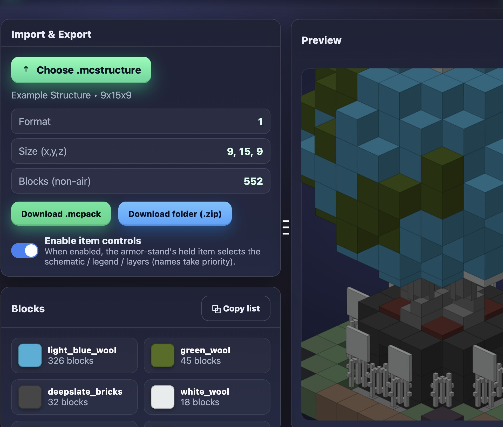

# Bedrock Schematic Maker

A powerful web-based tool for creating Minecraft Bedrock Edition schematics with an intuitive interface and smart shape generation.

## 🚀 Features

- **Smart Shape Generation**: Create complex structures with predefined shapes
- **Clean, Modern UI**: Dark theme with intuitive controls
- **Real-time Preview**: See your schematic as you build it
- **Export Functionality**: Download your creations as schematic files
- **Responsive Design**: Works on desktop and mobile devices

## 🛠️ How to Use

1. **Open the Tool**: Navigate to `index.html` in your web browser
2. **Select Blocks**: Choose from various block types in the blocks panel
3. **Create Shapes**: Use the shape tools to generate structures
4. **Customize**: Adjust dimensions and positions as needed
5. **Export**: Download your schematic file for use in Minecraft Bedrock Edition

## 🎮 Supported Shapes

- Cubes and rectangular prisms
- Spheres and ellipsoids
- Cylinders and cones
- Custom freehand building

## 📦 Technical Details

- **Pure HTML/CSS/JavaScript**: No server required
- **JSZip Integration**: For efficient file compression
- **Modern CSS**: Uses CSS Grid and Flexbox for layout
- **Responsive Design**: Adapts to different screen sizes

## 🌐 Live Demo

Check out the live version at: [https://malachyfernandez.github.io/Bedrock-Schematic-Maker/](https://malachyfernandez.github.io/Bedrock-Schematic-Maker/)

## 🤝 Contributing

Contributions are welcome! Feel free to:
- Report bugs
- Suggest new features
- Submit pull requests
- Improve documentation

## 📄 License

This project is open source and available under the [MIT License](LICENSE).

## 🔧 Setup

1. Clone this repository:
   ```bash
   git clone https://github.com/malachyfernandez/Bedrock-Schematic-Maker.git
   ```

2. Navigate to the project directory:
   ```bash
   cd Bedrock-Schematic-Maker
   ```

3. Open `index.html` in your web browser

No build process or dependencies required - it's a standalone web application!

## 🐛 Bug Reports

If you encounter any issues, please:
1. Check existing issues on GitHub
2. Create a new issue with detailed information
3. Include steps to reproduce the problem
4. Specify browser and OS information

## 💡 Future Enhancements

- More block types and variations
- Advanced shape tools
- Schematic import functionality
- Multi-language support
- Keyboard shortcuts

---

Made with ❤️ for the Minecraft community
